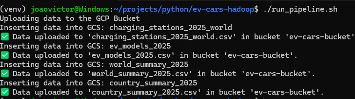

<!-- export GOOGLE_APPLICATION_CREDENTIALS="path/to/credentials.json" -->

## Global Eletric Vehicles (EV) Charging Stations

## Why? 
Electric vehicles are the future of transportation. Many countries around the world offer incentives to encourage the purchase and adoption of electric vehicles by their populations. However, despite these incentives, most customers are still unwilling to buy them. One reason is the availability of charging stations, which many consider to be a bottleneck. In this project, we'll take a deep dive into the data on charging stations worldwide and analyze the current situation.

## About this project
We obtained the dataset from Kaggle ([Global EV Charging Stations](https://www.kaggle.com/datasets/tarekmasryo/global-ev-charging-stations)). The data was then uploaded to a Google Cloud Dataproc cluster, where we performed data analysis using Hive. This workflow allows us to efficiently process and analyze large-scale EV charging station data leveraging the scalability of GCP and the querying power of Hive.

## Stacks
We used the following stack for this project:

- ☁️ **Google Cloud Platform (GCP) Bucket**: For storing and managing large datasets in the cloud.
- 🐍 **Python**: For data preprocessing, transformation, and orchestration tasks.
- 🐘 **Hadoop with Hive**: For distributed data processing and advanced SQL-based analytics on big data.

This combination enabled us to efficiently handle, process, and analyze global EV charging station data at scale.

## About the data

This project analyzes four comprehensive datasets related to electric vehicle infrastructure and adoption worldwide. The datasets provide insights into charging station distribution, electric vehicle models, and country-level statistics.

### Dataset 1: Charging Stations (`charging_stations_2025_world.csv`)
**Description**: Global dataset of electric vehicle charging stations with detailed technical specifications and geographic information.

**Size**: 242,419 records

| Field Name | Data Type | Description | Example Values |
|------------|-----------|-------------|----------------|
| `id` | BIGINT | Unique identifier for each charging station | 307660, 301207 |
| `name` | STRING | Name or description of the charging station | "Av. de Tarragona", "Parquing Costa Rodona" |
| `city` | STRING | City where the station is located | "Andorra", "Encamp" |
| `country_code` | STRING | country code | "AD", "US", "GB" |
| `state_province` | STRING | State or province (when applicable) | "California", "Ontario" |
| `latitude` | DOUBLE | Geographic latitude coordinate | 42.505254, 1.528861 |
| `longitude` | DOUBLE | Geographic longitude coordinate | 1.528861, -122.4194 |
| `ports` | INT | Number of charging ports available at the station | 1, 10, 4 |
| `power_kw` | DOUBLE | Power rating in kilowatts | 300.0, 22.0, 11.0 |
| `power_class` | STRING | Classification of charging power level | "DC_ULTRA_(>=150kW)", "AC_HIGH_(22-49kW)", "AC_L2_(7.5-21kW)" |
| `is_fast_dc` | BOOLEAN | Indicates if the station supports fast DC charging | true, false |

**Power Class Categories**:
- `AC_L2_(7.5-21kW)`: Level 2 AC charging (slow to medium speed)
- `AC_HIGH_(22-49kW)`: High-power AC charging (fast AC)
- `DC_ULTRA_(>=150kW)`: Ultra-fast DC charging (fastest charging)

### Dataset 2: Electric Vehicle Models (`ev_models_2025.csv`)
**Description**: Comprehensive catalog of electric vehicle models available globally, including technical specifications and market availability.

**Size**: 65 records

| Field Name | Data Type | Description | Example Values |
|------------|-----------|-------------|----------------|
| `make` | STRING | Vehicle manufacturer/brand | "Tesla", "BMW", "Nissan" |
| `model` | STRING | Specific vehicle model name | "Model S", "Model 3", "i3" |
| `market_regions` | STRING | Comma-separated list of regions where the model is available | "Global (US/EU/UK/ME)", "US/EU" |
| `powertrain` | STRING | Type of electric powertrain | "BEV" (Battery Electric), "PHEV" (Plug-in Hybrid) |
| `first_year` | STRING | Year when the model was first introduced | "2012", "2017", "2020" |
| `body_style` | STRING | Vehicle body type/category | "Sedan", "SUV", "Hatchback" |
| `origin_country` | STRING | Country where the vehicle is manufactured | "US", "DE", "JP" |

**Powertrain Types**:
- `BEV`: Battery Electric Vehicle (fully electric)
- `PHEV`: Plug-in Hybrid Electric Vehicle (electric + gasoline)
- `FCEV`: Fuel Cell Electric Vehicle (hydrogen-powered)

### Dataset 3: Country Summary (`country_summary_2025.csv`)
**Description**: Aggregated statistics by country showing the total number of charging stations and maximum power capabilities.

**Size**: 124 records

| Field Name | Data Type | Description | Example Values |
|------------|-----------|-------------|----------------|
| `country_code` | STRING | country code | "US", "GB", "DE" |
| `country` | STRING | Full country name | "United States", "United Kingdom", "Germany" |
| `count` | INT | Total number of charging stations in the country | 83821, 27437, 24465 |
| `max_power_kw_max` | INT | Maximum power rating (in kW) available in the country | 600, 560, 400 |

### Dataset 4: World Summary (`world_summary_2025.csv`)
**Description**: Global aggregated statistics providing high-level insights into the worldwide EV charging infrastructure.

**Size**: 124 records

| Field Name | Data Type | Description | Example Values |
|------------|-----------|-------------|----------------|
| `country_code` | STRING | country code | "US", "GB", "DE" |
| `stations` | INT | Number of charging stations in the country | 82138, 26825, 23373 |


## Getting started

To set up a Python virtual environment for this project, follow these steps:

1. **Clone this project**
2. **Create a virtual environment** (recommended: Python 3.8+):
3. **Installing packages**: 
     ```python
     pip install -r requirements.txt
     ```
4. **Create your Service Account Key as a env file**
    ```bash
    export GOOGLE_APPLICATION_CREDENTIALS="path/to/your_credentials.json"
    ```
5. **Create a bucket into GCS with the name 'ev-cars-bucket'

6. **Run the pipeline file**
    ```bash
    chmod +x run_pipeline.sh
    ./run_pipeline.sh
    ```

If you saw something like this, you're ready!

    